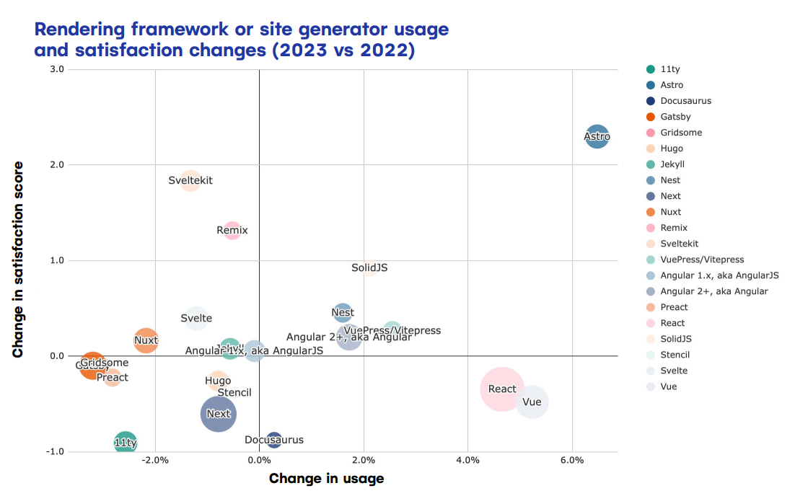

Astro is swiftly becoming a favorite framework for web developers for its modern, performance-focused approach to web development. This guide will introduce you to Astro, highlighting its simplicity, efficiency, and developer experience. Astro has seen rapid adoption and ranks as the top framework based on usage and satisfaction. In fact, most developers are keen to revisit, according to Netlify's "The State of Web Development Report."



Here's why Astro is gaining such momentum:

- **Ease of Use**: With an <mark style="background-color: #f5deb3;">intuitive CLI, diverse templates, and precise documentation</mark>, Astro ensures a smooth start and ongoing simplicity, even as it evolves.
- **Flexibility**: Astro's <mark style="background-color: #f5deb3;">"Bring Your Own UI Framework"</mark> approach supports emerging libraries like React, Solid, and Qwik, ensuring versatility.
- **Community**: With over 10,000 developers on Discord, Astro Here is some text and <mark style="background-color: #f5deb3;">offers an environment ripe for collaboration and support</mark>.

# Requirements
The follwing four steps equip you with essential links to download the necessary tools.
Whether you're just starting out or are already familiar with concepts like CLI or
frameworks, you won't need to dive deep into these topics here.
Our goal is to streamline your setup process,
allowing you to initiate your first Astro project swiftly and efficiently.
as long as you're behind a computer you can access all the required tools. Follow the steps below closely.

#### 1. Install Terminal
Download Windows Terminal via [Microsoft App](https://apps.microsoft.com/detail/9N0DX20HK701?hl=en-US&gl=US) or open Terminal on Mac.

#### 2. Install WSL2 (WINDOWS ONLY)
I recommend setting up a Linux environment, it's not required, but from my experience it works more seamlessly for software installation, you'll thank me later. [Install WSL Here!](https://learn.microsoft.com/en-us/windows/wsl/install). This step is unnecessary for Mac users.

#### 3. Install Text Editor
Download [VS Code](https://code.visualstudio.com/download). Although it's not needed to run the project, which can be done directly from the terminal, it will help you become more familiar with the framework's folder structure.

#### 4.Terminal Commands
Ensure you completed step one and that your terminal is open. Navigate to the links and copy and paste the appropriate commands into your terminal for Mac, Windows, or Linux.
- Install [NVM](https://www.freecodecamp.org/news/node-version-manager-nvm-install-guide/)
- Install [NPM](https://dev.to/ms314006/how-to-install-npm-through-nvm-node-version-manager-5gif)
- Install [GitHub CLI](https://github.com/cli/cli?tab=readme-ov-file#installation)
- Install [Astro CLI](https://docs.astro.build/en/install/auto/)

With these steps completed, you have all the necessary tools to get up an running with Astro within minutes.

# Getting Started
The following video takes you through the steps. I will leave the necessary commands below as well if you're not interested in watching. 
<div style={{ display: 'flex', justifyContent: 'center' }}>
  <iframe width="560" height="315" src="https://www.youtube.com/embed/TYogYBTS7YQ" title="YouTube video player" frameborder="0" allow="accelerometer; autoplay; clipboard-write; encrypted-media; gyroscope; picture-in-picture; web-share" allowfullscreen></iframe>
</div>
<p></p>
```
gh --version
```
<p></p>
```
nvm ls
```
<p></p>

```
 npm create astro@latest
```
<p></p>

```
<!--  After creating project, you'll need to navigate into your project directory with:  -->
cd ./name_of_your_project
```
<p></p>
<p></p>

```
code .
```
<p></p>
<p></p>

```
<!-- Navigate to IDE Terminal Windows -->
ctrl + shift + p 

<!-- Navigate to IDE Terminal Mac -->
cmd + `
```
<p></p>
```
 npm run dev
```
At this point, you're ready to launch the local server and explore your project.
Consider this platform your personal sandbox for honing your development abilities,
which is exactly how I'm using it. It's an ideal setting to refine your HTML, CSS, and
 JavaScript prowess. Leverage it as a foundational template while absorbing knowledge
 from various tutorials. Additionally, you have the option to sync this project with a
  GitHub repository to facilitate continuous integration. From there, deploying to a
  CDN like Netlify, Vercel, or Bun is seamless, allowing you to link a domain to your project,
  optimizing it for marketing and SEO purposes. Essentially,
  this environment is your gateway to the expansive universe of web development.